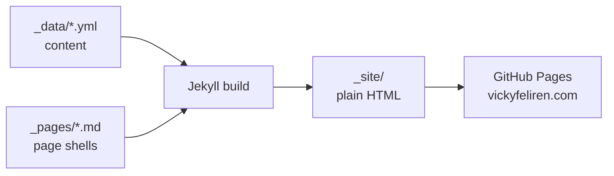
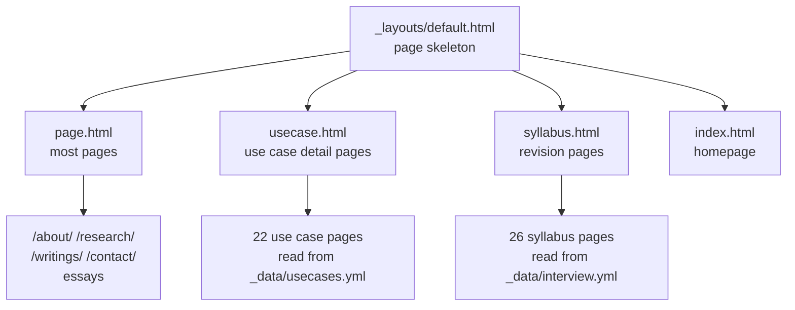
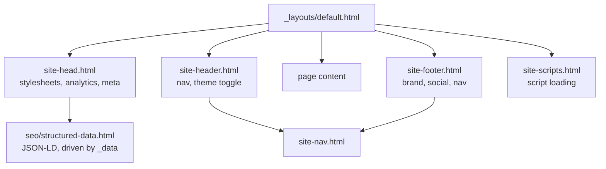
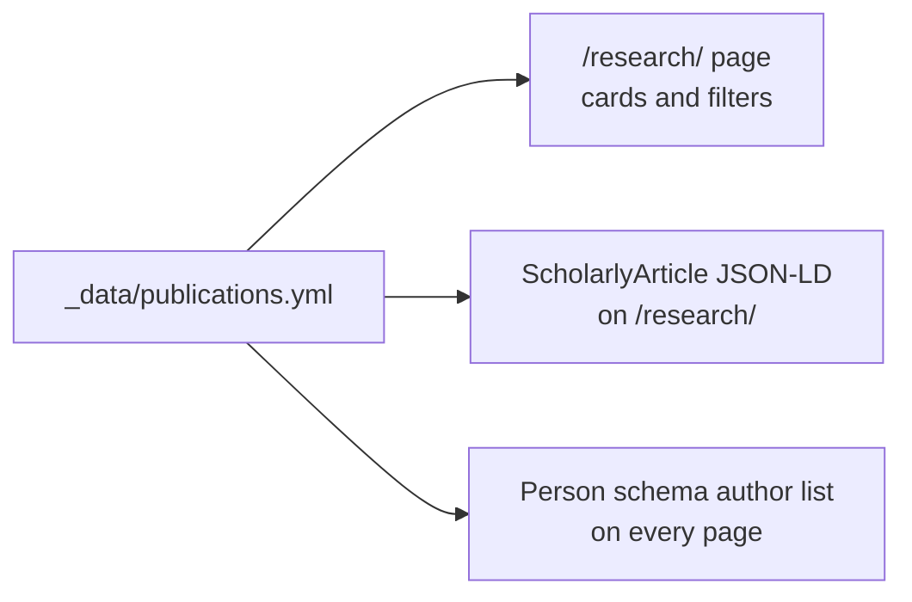

# Vicky Feliren — Personal Website

The personal site of Vicky Feliren, an Applied Scientist working on **calibration under safety alignment**.

The short version of the research: safety training costs a model some of its sense of what it knows. That cost is usually reported as one averaged number. It is probably not one number at all, and measuring its real shape is the work.

The site is a static Jekyll build. It deploys to GitHub Pages at [vickyfeliren.com](https://vickyfeliren.com).

## How the site is built

Content lives in YAML files. Templates read those files and render pages. There is no database and no framework.



To change what a page says, edit the YAML file. To change how it looks, edit the layout or the CSS.

## Page structure

Every page uses the same base layout. Three templates extend it.



`default.html` holds no markup of its own. It is a list of includes, one per
concern:



`usecase.html` and `syllabus.html` do the real work. Each looks up an entry by an
id in the page front matter (`uc_id`, `topic_id`), pulls the content from its
data file, and builds the page. `usecase.html` also generates a sticky table of
contents when a page has three or more sections.

## Where content comes from

Each page is driven by one data file.

| Page | Data file |
|---|---|
| Homepage | `_data/index.yml`, `_data/about.yml`, `_data/now.yml` |
| About | `_data/about.yml` |
| Research | `_data/publications.yml` |
| Use Cases | `_data/usecases.yml` |
| Writings | `_data/notes.yml`, `_data/features.yml`, `_data/thoughts.yml` |
| Work With Me | `_data/contact.yml` |
| Awards | `_data/awards.yml` |
| Skills, technical and not (shown on `/cv`) | `_data/skills.yml` |
| Experience | `_data/experience.yml` |
| Project timeline | `_data/timeline.yml` |
| Navigation, header and footer | `_data/navigation.yml` |
| Author identity, used by the Person schema | `_data/identity.yml` |
| Press coverage and talks | `_data/media.yml`, `_data/events.yml` |

Several files are generated, not written by hand. A hand edit to any of them is
lost the next time its script runs.

| Generated | Produced by |
|---|---|
| `_data/uc_banners.yml`, `assets/img/usecases/*.webp` | `scripts/generate_uc_banners.py` |
| `_data/game_theory.yml` | `scripts/solve_games.py` |
| `_data/stoic.yml` | verified against public-domain sources |
| `_data/interview_math.yml` | `scripts/render_math.py` |
| `_includes/interview-icons.html` | `scripts/generate_icons.py` |

For the use case diagrams, edit the `SPECS` list in `generate_uc_banners.py`, run
it, and commit what it produces.

## Publications update three things at once

Adding a paper to `_data/publications.yml` updates the research page, the research page's JSON-LD, and the site-wide Person schema. You only edit the one file.



Required fields: `key`, `kind`, `tag`, `title`, `description`, `venue`, `year`, `url`, `abstract`, `keywords`, `authors`.

The `kind` field decides which filter button shows the entry. Valid values are `geospatial`, `cultural`, `nlp`, and `applied`.

## Project structure

```
feliren88.github.io/
├── README.md          # This file
├── CLAUDE.md          # Development guidelines and writing rules
├── docs/              # Detail on one subsystem each, read on demand
├── Makefile           # Every local task. `make` lists them
├── llms.txt           # Site summary for language models
├── robots.txt         # Crawler rules, points to the sitemap
├── _config.yml        # Jekyll configuration
├── Gemfile            # Ruby dependencies
├── index.html         # Homepage
├── sw.js              # Service worker
├── 404.html
├── CNAME              # Custom domain
├── _dev/              # Local build shim. Not part of the site
├── _layouts/
│   ├── default.html   # Page skeleton, assembled from includes
│   ├── page.html      # Standard page
│   ├── usecase.html   # Use case detail page
│   └── syllabus.html  # Revision syllabus page
├── _includes/
│   ├── site-head.html    site-header.html    site-nav.html
│   ├── site-footer.html  site-scripts.html   asset.html
│   ├── seo/           # One file per schema, all driven by _data
│   └── *-icons.html   # SVG symbol sprites
├── _pages/
│   ├── about.md  skills.md  experience.md  publications.md
│   ├── awards.md  thoughts.md  contact.md  project.md  heron.md
│   ├── usecases.md    # Listing page
│   ├── usecases/      # 22 detail pages
│   ├── interview/     # 26 syllabus pages, unlisted
│   └── essays/        # Long-form essays
├── _data/             # All page content, as YAML
├── scripts/           # Generators, verifiers, audits. Not published
├── assets/
│   ├── fonts/         # Manrope + Space Grotesk, latin subsets only
│   └── img/           # All WebP, including generated use case diagrams
├── css/
│   ├── styles.css     # Global: tokens, type, every shared component
│   └── *.css          # One per page heavy enough to need its own
├── js/
│   ├── main.js        # Point cloud, filters, tilt, reveal animations
│   └── components/    # One per page that needs behaviour
└── notes/             # Private. Gitignored and excluded from the build.
```

## Navigation

All nav links live in `_data/navigation.yml`. The header and the footer both
render from it through `_includes/site-nav.html`, so adding an entry puts the
link in both places.

```yaml
primary:
  - label: About
    href: /
  - label: Writings
    href: /writings/
    owns:          # extra URL prefixes that should mark this item active
      - /stoic
      - /game-theory
```

Which item is highlighted is worked out during the build, not in the browser, so
it is correct with JavaScript off and never flickers on load. An item is active
on its own href, on anything beneath it, and on any prefix under `owns:`. That
last one is how a long-form note at its own top-level URL still highlights
Writings.

## Technology

- **Jekyll** — static site generator, Liquid templates
- **HTML5** — semantic markup
- **CSS3** — custom properties, Grid and Flexbox, mobile first
- **JavaScript** — vanilla ES6, no frameworks
- **jekyll-seo-tag** — meta tags
- **jekyll-sitemap** — sitemap

## Performance

- Every image is WebP. No PNG, JPG, or SVG sources are kept.
- The hero image uses `<picture>` with a 450px and an 880px source.
- Above-the-fold images get `fetchpriority="high"`. Pages can preload a background image by setting `preload_image:` in their front matter.
- Everything below the fold gets `loading="lazy"`.
- Fonts are preloaded and limited to the latin and latin-ext subsets.
- The service worker serves assets cache-first and HTML network-first.
- The point cloud animation waits for `requestIdleCallback`, with a 1.5 second timeout.

## Accessibility

The site targets **WCAG 2.1 AA**.

- A skip-to-content link is the first thing you can tab to.
- Every interactive element shows a `:focus-visible` outline.
- Interactive borders use `--border-ui`, which clears 3:1 contrast.
- `--text`, `--muted`, and `--accent` all pass contrast against the background.
- Regions that change get `aria-live="polite"`.
- Decorative images are marked `aria-hidden="true"`.
- Headings run h1 for the name, h2 for sections, h3 for cards.

## Structured data

Every page carries a schema graph. It is built from data files, so adding an
award or a talk needs no template change.

| Block | Built from | By |
|---|---|---|
| `Person` | `_data/identity.yml` | `_includes/seo/person.html` |
| `WebSite`, `ContactPoint`, `ProfilePage`, employer | `_data/identity.yml` | `_includes/seo/site-entities.html` |
| One `ScholarlyArticle` per paper | `_data/publications.yml` | `_includes/seo/publications.html` |
| One `Article` per press mention, one `Event` per talk | `_data/media.yml`, `_data/events.yml` | `_includes/seo/media-and-events.html` |
| `BreadcrumbList` on dated pages | the page | `_includes/seo/structured-data.html` |
| `BlogPosting` on dated pages | the page | `jekyll-seo-tag` |

Everything refers to the author by `@id` rather than repeating them, so the
Person block is written once and pointed at from everywhere else.

The research page carries a second block of its own: CollectionPage plus
ScholarlyArticle, also generated from `publications.yml`.

## Running it locally

```bash
make install   # bundle install
make serve     # http://localhost:4000, live reload
make build     # build into _site/
make check     # build, then audit SEO and internal links
make diff      # prove a change altered no built output
```

`make` on its own lists them.

Use `make`, not `bundle exec jekyll` directly. The `github-pages` gem pins
liquid 4.0.3, which calls a Ruby API removed in 3.2, so a bare build fails on any
current Ruby. `_dev/ruby-compat.rb` restores the missing methods as no-ops and
the Makefile loads it. GitHub Pages builds on its own Ruby with the same gem pin,
so the shim is local-only and cannot change what ships.

## Deploying

```bash
git add -A
git commit -m "description"
git push origin main
```

GitHub Pages builds from `main` itself. There is no workflow file, which is why
the `github-pages` pin in the `Gemfile` is what production runs.

## Things worth knowing before you edit

- **Never hand-write a `?v=` cache-busting number.** Asset URLs are emitted
  through `_includes/asset.html`, which stamps each one with that file's own
  modified time. A literal version in a URL will not match what the service
  worker precaches, and the browser ends up holding two copies of the same file.
- **Read `CLAUDE.md` before writing any copy.** It sets the voice: short
  sentences, no em dashes, British spelling, no invented numbers.
- **Do not hand-edit anything listed as generated above.** Edit the script.
- **`notes/` stays private.** It is in `.gitignore` and in the `_config.yml`
  exclude list. Both are needed, because Jekyll copies unrecognised files into
  `_site/` and would otherwise publish them.
- **Run `make diff` after a structural change.** It builds the committed tree and
  the working tree and compares the output, so a refactor can be shown to have
  changed nothing.

## Contact

- Email: vickyfeliren@gmail.com
- LinkedIn: [@feliren](https://linkedin.com/in/feliren)
- GitHub: [@feliren88](https://github.com/feliren88)
- Medium: [@feliren](https://medium.com/@feliren)
