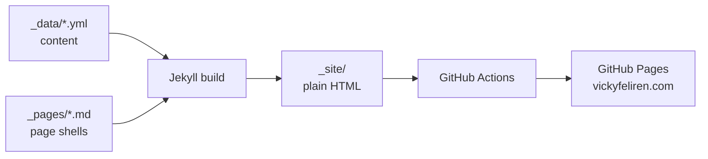
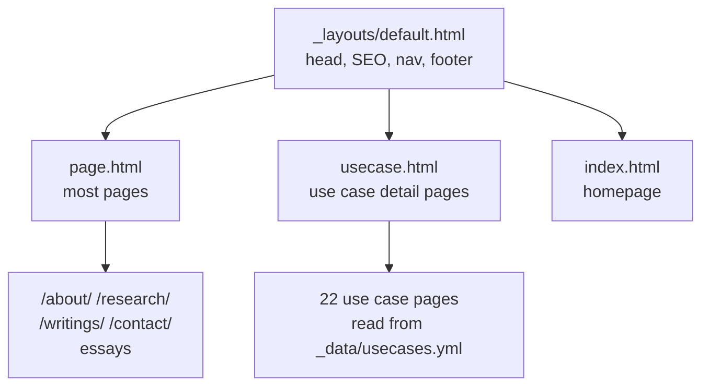
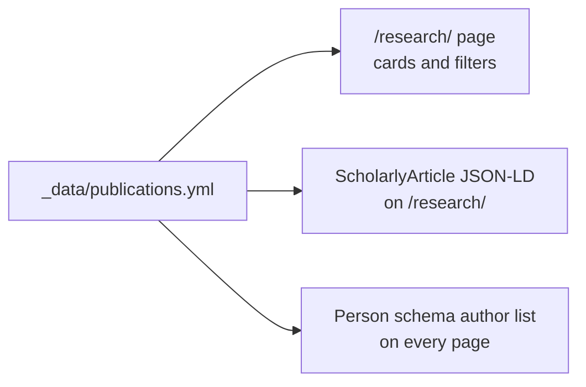

# Vicky Feliren — Personal Website

The personal site of Vicky Feliren, an Applied Scientist working on **calibration under safety alignment**.

The short version of the research: safety training costs a model some of its sense of what it knows. That cost is usually reported as one averaged number. It is probably not one number at all, and measuring its real shape is the work.

The site is a static Jekyll build. It deploys to GitHub Pages at [vickyfeliren.com](https://vickyfeliren.com).

## How the site is built

Content lives in YAML files. Templates read those files and render pages. There is no database and no framework.



To change what a page says, edit the YAML file. To change how it looks, edit the layout or the CSS.

## Page structure

Every page uses the same base layout. Two templates extend it.



`usecase.html` is the only template that does real work. It looks up a use case by the `uc_id` in the page front matter, pulls the content from `_data/usecases.yml`, and builds the page. It also generates a sticky table of contents when a page has three or more sections.

## Where content comes from

Each page is driven by one data file.

| Page | Data file |
|---|---|
| Homepage | `_data/index.yml`, `_data/about.yml`, `_data/now.yml` |
| About | `_data/about.yml` |
| Research | `_data/publications.yml` |
| Use Cases | `_data/usecases.yml` |
| Writings | `_data/notes.yml`, `_data/features.yml`, `_data/thoughts.yml` |
| Work With Me | `_data/contact.yml` |
| Awards | `_data/awards.yml` |
| Technical skills (shown on `/cv`) | `_data/skills.yml` |
| Experience | `_data/experience.yml` |
| Project timeline | `_data/timeline.yml` |

Two files are generated, not written by hand:

- `_data/uc_banners.yml` — alt text for the use case diagrams
- `assets/img/usecases/*.webp` — the diagrams themselves

Both come from `scripts/generate_uc_banners.py`. Edit the `SPECS` list in that script, run it, and commit what it produces.

## Publications update three things at once

Adding a paper to `_data/publications.yml` updates the research page, the research page's JSON-LD, and the site-wide Person schema. You only edit the one file.



Required fields: `key`, `kind`, `tag`, `title`, `description`, `venue`, `year`, `url`, `abstract`, `keywords`, `authors`.

The `kind` field decides which filter button shows the entry. Valid values are `geospatial`, `cultural`, `nlp`, and `applied`.

## Project structure

```
feliren88.github.io/
├── README.md          # This file
├── CLAUDE.md          # Development guidelines and writing rules
├── llms.txt           # Site summary for language models
├── robots.txt         # Crawler rules, points to the sitemap
├── _config.yml        # Jekyll configuration
├── Gemfile            # Ruby dependencies
├── index.html         # Homepage
├── sw.js              # Service worker
├── 404.html
├── CNAME              # Custom domain
├── _layouts/
│   ├── default.html   # Base layout
│   ├── page.html      # Standard page
│   └── usecase.html   # Use case detail page
├── _pages/
│   ├── about.md  skills.md  experience.md  publications.md
│   ├── awards.md  thoughts.md  contact.md  project.md  heron.md
│   ├── usecases.md    # Listing page
│   ├── usecases/      # 22 detail pages
│   └── essays/        # Long-form essays
├── _data/             # All page content, as YAML
├── scripts/
│   └── generate_uc_banners.py   # Renders the use case diagrams
├── assets/
│   ├── fonts/         # Manrope + Space Grotesk, latin subsets only
│   └── img/           # All WebP, including generated use case diagrams
├── css/
│   └── styles.css     # Everything, currently served as ?v=40
├── js/
│   ├── main.js        # Point cloud, filters, tilt, reveal animations
│   └── components/
│       ├── nav.js     # Navigation, single source of truth
│       └── timeline.js
└── notes/             # Private. Gitignored and excluded from the build.
```

## Navigation

All nav links live in the `NAV_ITEMS` array in `js/components/nav.js`. Change that array and every page updates.

```js
var NAV_ITEMS = [
  { href: '/',          label: 'About',        page: '/' },
  { href: '/research/', label: 'Research',     page: '/research' },
  { href: '/usecases/', label: 'Use Cases',    page: '/usecases' },
  { href: '/writings/', label: 'Writings',     page: '/writings' },
  { href: '/contact/',  label: 'Work With Me', page: '/contact' },
];
```

The `<nav>` block hardcoded in `default.html` is the fallback for visitors with JavaScript off.

## Technology

- **Jekyll** — static site generator, Liquid templates
- **HTML5** — semantic markup
- **CSS3** — custom properties, Grid and Flexbox, mobile first
- **JavaScript** — vanilla ES6, no frameworks
- **jekyll-seo-tag** — meta tags
- **jekyll-sitemap** — sitemap

## Performance

- Every image is WebP. No PNG, JPG, or SVG sources are kept.
- The hero image uses `<picture>` with a 450px and an 880px source.
- Above-the-fold images get `fetchpriority="high"`. Pages can preload a background image by setting `preload_image:` in their front matter.
- Everything below the fold gets `loading="lazy"`.
- Fonts are preloaded and limited to the latin and latin-ext subsets.
- The service worker serves assets cache-first and HTML network-first.
- The point cloud animation waits for `requestIdleCallback`, with a 1.5 second timeout.

## Accessibility

The site targets **WCAG 2.1 AA**.

- A skip-to-content link is the first thing you can tab to.
- Every interactive element shows a `:focus-visible` outline.
- Interactive borders use `--border-ui`, which clears 3:1 contrast.
- `--text`, `--muted`, and `--accent` all pass contrast against the background.
- Regions that change get `aria-live="polite"`.
- Decorative images are marked `aria-hidden="true"`.
- Headings run h1 for the name, h2 for sections, h3 for cards.

## Structured data

`_layouts/default.html` carries a Person schema on every page.

| Property | Value |
|---|---|
| `@type` | Person |
| `@id` | `https://vickyfeliren.com/` |
| `jobTitle`, `alumniOf`, `worksFor` | Applied Scientist, Monash University |
| `knowsAbout` | 8 domains, led by Trustworthy AI, Multimodal AI, and AI Safety |
| `knowsLanguage` | English, Indonesian |
| `award` | 12 entries |
| `memberOf` | SEACrowd, ACL, IEEE |
| `colleague` | Risqi Saputra, Taufiq Asyhari |
| `author` | Generated from `_data/publications.yml` |
| `sameAs` | 12 profiles |

The research page carries a second block: CollectionPage plus ScholarlyArticle, also generated from `publications.yml`.

## Running it locally

```bash
bundle install
bundle exec jekyll serve --livereload
```

The site runs at `http://localhost:4000`.

To build without serving:

```bash
bundle exec jekyll build
```

Output lands in `_site/`.

## Deploying

```bash
git add -A
git commit -m "description"
git push origin main
```

GitHub Actions builds and publishes from there.

## Things worth knowing before you edit

- **Bump the CSS version.** After editing `css/styles.css`, change the `?v=` number in `_layouts/default.html` and update the matching entry in the `sw.js` precache list. Skip this and visitors keep the old stylesheet.
- **Read `CLAUDE.md` before writing any copy.** It sets the voice: short sentences, no em dashes, British spelling, no invented numbers.
- **Do not hand-edit the use case diagrams.** They are generated. Edit `scripts/generate_uc_banners.py` instead.
- **`notes/` stays private.** It is in `.gitignore` and in the `_config.yml` exclude list. Both are needed, because Jekyll copies unrecognised files into `_site/` and would otherwise publish them.

## Contact

- Email: vickyfeliren@gmail.com
- LinkedIn: [@feliren](https://linkedin.com/in/feliren)
- GitHub: [@feliren88](https://github.com/feliren88)
- Medium: [@feliren](https://medium.com/@feliren)
